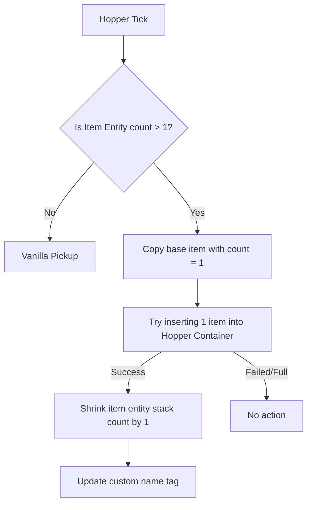

# Architectural Design - Item Clumping (Server-Side Only)

This document details the internal design, injection points, network synchronization, and data flows of the server-side only item clumping system.

---

## 🏗️ System Overview

The mod runs entirely on the **logical server** (fully compatible with vanilla clients). Instead of using custom entity data trackers and custom client-side renderers, it relies purely on vanilla network protocols and entity fields.

### Data Storage & Synchronization
1. **Direct Stack Storage**: The virtual count is stored directly inside the standard `ItemStack` count (`this.getItem().getCount()`). Because Minecraft 26.x serializes stack counts as `VarInt` / standard integers in the network protocol, vanilla clients can natively receive, track, and hold entity stack sizes larger than 64.
2. **Vanilla Custom Name Tags**: To render floating labels above clumps (e.g. `Stone x500`), the server dynamically sets the entity's custom name:
   `itemEntity.setCustomName(Component.literal("Stone x" + count))`
   `itemEntity.setCustomNameVisible(true)`
   Vanilla clients natively listen to standard data trackers for custom name visibility and render them above the entity out-of-the-box.
3. **Automatic Persistence**: Because counts are stored inside the standard `ItemStack`, standard Minecraft NBT serialization automatically handles loading and saving the true clump count to the world save files. No custom NBT tags or serialization mixins are required.
4. **Clean ItemStacks on Pickup**: Once a player picks up the item clump, it is broken down into standard stack sizes (typically 64) before entering the inventory. Picked up items remain completely clean vanilla items with no custom names or extra components.

---

## 🔄 Interaction Flows

### Merging Items
When two `ItemEntity` instances come close, Minecraft triggers `mergeWithNeighbours`. The mod overrides the merge mechanics to transfer counts between the stacks.

```mermaid
sequenceDiagram
    participant Level as World Loop
    participant A as ItemEntity A (This)
    participant B as ItemEntity B (Other)
    
    Level->>A: tick()
    A->>A: mergeWithNeighbours() (radius customized via GameRule)
    A->>B: tryToMerge() (Mixin Inject)
    
    rect rgb(25, 25, 40)
        Note over A, B: Merge Feasibility Checks<br/>(Matching UUID target? Same item type/components?)
    end
    
    alt Combined count <= maxClumpSize
        alt B's count < A's count
            A->>A: Set count of A = A + B
            A->>A: age = Math.min(age, B.age)
            A->>A: pickupDelay = Math.max(pickupDelay, B.pickupDelay)
            A->>A: Update custom name tag
            A->>B: discard()
            Note over A: A absorbs B (Complete Merge)
        else B's count >= A's count
            B->>B: Set count of B = B + A
            B->>B: age = Math.min(age, A.age)
            B->>B: pickupDelay = Math.max(pickupDelay, A.pickupDelay)
            B->>B: Update custom name tag
            B->>A: discard()
            Note over B: B absorbs A (Complete Merge)
        end
    else Combined count > maxClumpSize
        A->>A: Fill A's count up to maxClumpSize
        B->>B: Shrink B's count by space absorbed
        A->>A: Update custom name tag
        B->>B: Update custom name tag
        Note over A, B: Partial Merge (Max Cap Reached)
    end
```

### Hopper Drip Extraction
To prevent virtual clumps from bypassing normal container intake constraints (hoppers absorbing hundreds of items instantly), the extraction flow is custom-routed:

---

## 🛠️ Mixin Targets

### 1. `ItemEntityMixin` (Target: `net.minecraft.world.entity.item.ItemEntity`)
- `tick`: Calls `item_clumps$updateVanillaNameTag()` to refresh custom name tags dynamically if configuration settings or rules change.
- `setItem`: Injects at `TAIL`. Triggers a custom name tag update whenever the stack changes.
- `isMergable`: Overrides vanilla's maximum stack cap (`item.getCount() < item.getMaxStackSize()`) with the configurable `max_clump_size` GameRule.
- `mergeWithNeighbours`: Modifies the arguments of the search bounding box to match the `item_clumps:merge_radius` GameRule.
- `tryToMerge`: Intercepts the merging logic. Calculates the combined count, clamps it to `max_clump_size`, and disposes of the merged entity. Performs optimized larger-absorbs-smaller count transfers, inheriting the youngest despawn age and maximum pickup delay.
- `playerTouch`: Intercepts the player pickup event. Distributes the virtual count into the player's inventory as maximum-sized stacks.

### 2. `HopperBlockEntityMixin` (Target: `net.minecraft.world.level.block.entity.HopperBlockEntity`)
- `addItem(Container, ItemEntity)`: Injects at `HEAD`. If the item entity has a count > 1, it inserts exactly 1 item into the hopper and shrinks the item entity's stack size by 1.
