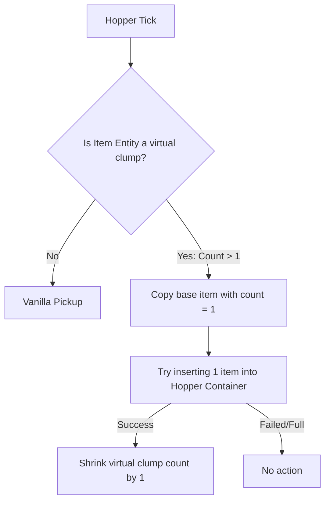

# Architectural Design - Item Clumping

This document details the internal design, injection points, network synchronization, and data flows of the item clumping system.

---

## 🏗️ System Overview

The mod uses a virtual stack representation to bypass Minecraft's hardcoded stack size limit (64) for in-world item entities. It achieves this by tracking a custom synced integer (`megaCount`) directly on the `ItemEntity` instance.

### Data Storage & Synchronization
1. **Interface Injection**: The interface `MegaCountData` is injected onto `ItemEntity` via Mixin.
2. **Network Synced Data**: The virtual count is tracked using Minecraft's `SynchedEntityData` system via a `MEGA_COUNT` data accessor. This ensures the count is automatically synchronized between the server and all watching clients.
3. **NBT Persistence**: The virtual count is serialized to and deserialized from NBT using the tag key `"mega_count"` in `ItemEntity` save/load methods.

---

## 🔄 Interaction Flows

### Merging Items
When two `ItemEntity` instances come close, Minecraft triggers `mergeWithNeighbours`. The mod overrides the merge mechanics to transfer counts between the virtual stacks instead of standard item stacks.

```mermaid
sequenceDiagram
    participant Level as World Loop
    participant A as ItemEntity A (This)
    participant B as ItemEntity B (Other)
    
    Level->>A: tick()
    A->>A: mergeWithNeighbours() (radius customized via GameRule)
    A->>B: tryToMerge() (Mixin Inject)
    
    rect rgb(25, 25, 40)
        Note over A, B: Merge Feasibility Checks<br/>(Matching UUID target? Same item type/components?)
    end
    
    alt Combined count <= maxClumpSize
        alt B's count < A's count
            A->>A: addMegaCount(Count of B)
            A->>A: age = Math.min(age, B.age)
            A->>A: pickupDelay = Math.max(pickupDelay, B.pickupDelay)
            A->>B: discard()
            Note over A: A absorbs B (Complete Merge)
        else B's count >= A's count
            B->>B: addMegaCount(Count of A)
            B->>B: age = Math.min(age, A.age)
            B->>B: pickupDelay = Math.max(pickupDelay, A.pickupDelay)
            B->>A: discard()
            Note over B: B absorbs A (Complete Merge)
        end
    else Combined count > maxClumpSize
        A->>A: Fill up to maxClumpSize
        B->>B: Shrink count by space absorbed
        Note over A, B: Partial Merge (Max Cap Reached)
    end
```

### Hopper Drip Extraction
To prevent virtual clumps from bypassing normal container intake constraints (hoppers absorbing hundreds of items instantly), the extraction flow is custom-routed:

---

## 🛠️ Mixin Targets

### 1. `ItemEntityMixin` (Target: `net.minecraft.world.entity.item.ItemEntity`)
- `defineSynchedData`: Registers the custom `MEGA_COUNT` data tracker.
- `setItem`: Intercepts stack sets. If a stack is natively spawned with size > 1, the mod converts the overflow into the virtual `megaCount` and sets the native stack size to 1.
- `mergeWithNeighbours`: Modifies the arguments of the search bounding box to match the `item_clumps:merge_radius` GameRule.
- `tryToMerge`: Intercepts the merging logic. Calculates the combined count, clamps it to `max_clump_size`, and disposes of the merged entity. Performs optimized larger-absorbs-smaller count transfers, inheriting the youngest despawn age (`Math.min(age, other.age)`) and the maximum pickup delay (`Math.max(pickupDelay, other.pickupDelay)`) to match vanilla rules.
- `playerTouch`: Intercepts the player pickup event. Distributes the virtual count into the player's inventory as maximum-sized stacks.
- `addAdditionalSaveData`/`readAdditionalSaveData`: Handles saving and loading the `"mega_count"` integer to/from NBT.

### 2. `HopperBlockEntityMixin` (Target: `net.minecraft.world.level.block.entity.HopperBlockEntity`)
- `addItem(Container, ItemEntity)`: Injects at `HEAD`. If the item entity has a virtual count > 1, it inserts exactly 1 item into the hopper and shrinks the virtual count of the entity by 1, bypassing vanilla's instant absorption of the entire stack.

### 3. `ItemEntityRendererMixin` (Target: `net.minecraft.client.renderer.entity.ItemEntityRenderer`)
- `extractRenderState`: Injects at `TAIL` (client-side only). Extracts the `megaCount`. If it exceeds the item's maximum native stack size, it appends a custom name tag displaying the format `<Item Name> x<megaCount>` above the item, visible within a 64-block distance.
